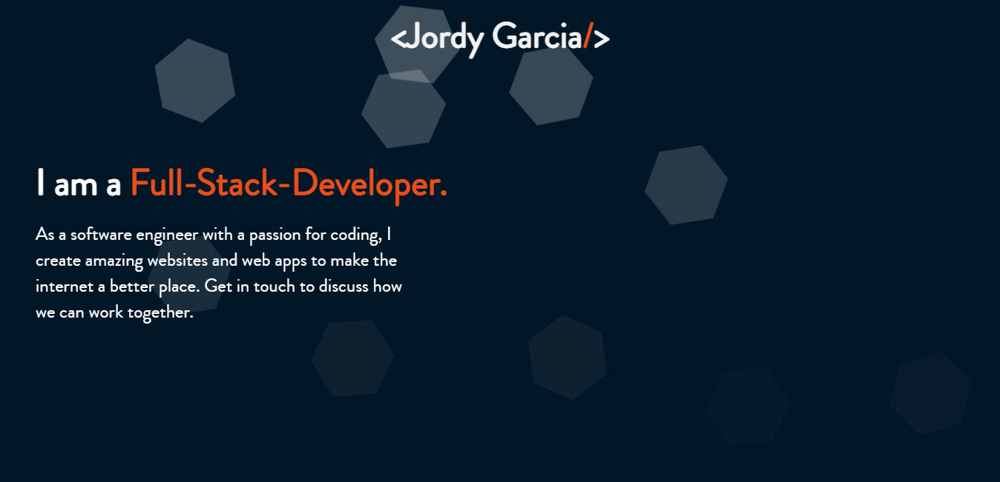

# Portfolio

> Welcome to my personal portfolio.

## Built With

- Javascript
- SASS
- CSS3

## Getting Started

To get a local copy up and running follow these simple example steps.

## Live Demo

[Live Demo Link](https://garciajordy.github.io/Portfolio-v2/)

## Instructions

To get a local copy up and running follow these simple example steps.

### Setup

- Clone in the terminal or download this entire [GitHub Repo](https://github.com/garciajordy/Portfolio-v2) and go to the index.html file.

### Install

- Set up liveserver as an extension in your VS Code.
- If you dont have the live server extension, or are using another software just view directly in your browser.

### Usage

- Right click and open the index.html in your browser to view.

## Authors

👤 **Jordy Garcia**

- GitHub: [@githubhandle](https://github.com/garciajordy)
- LinkedIn: [LinkedIn](https://www.linkedin.com/in/jordy-garcia-675849206/)

## 🤝 Contributing

Contributions, issues, and feature requests are welcome!

Feel free to check the [issues page](https://github.com/garciajordy/Portfolio-v2/issues).

## Show your support

Give a ⭐️ if you like this project!

## Acknowledgments

- Hat tip to anyone whose code was used
- Inspiration
- etc

## 📝 License

This project is [MIT](lic.url) licensed.
